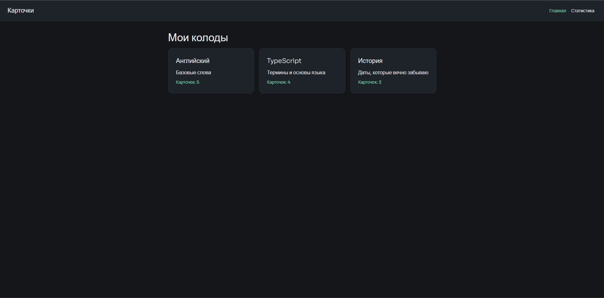
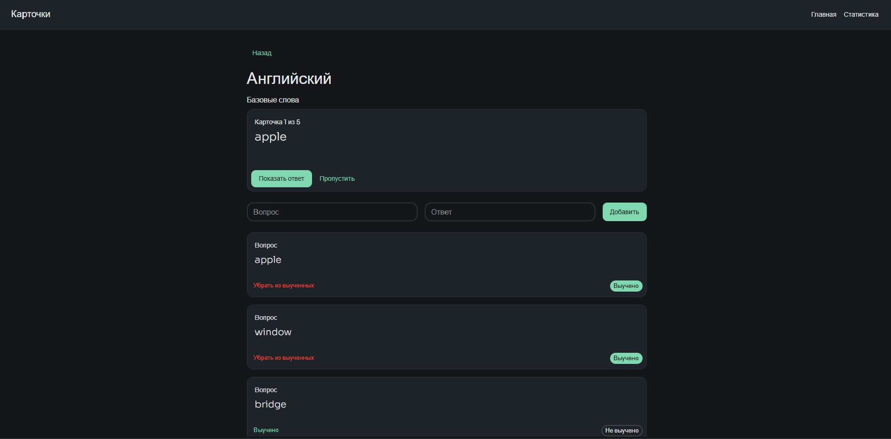
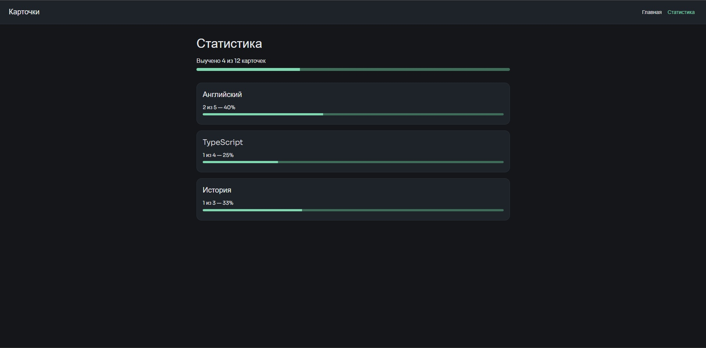
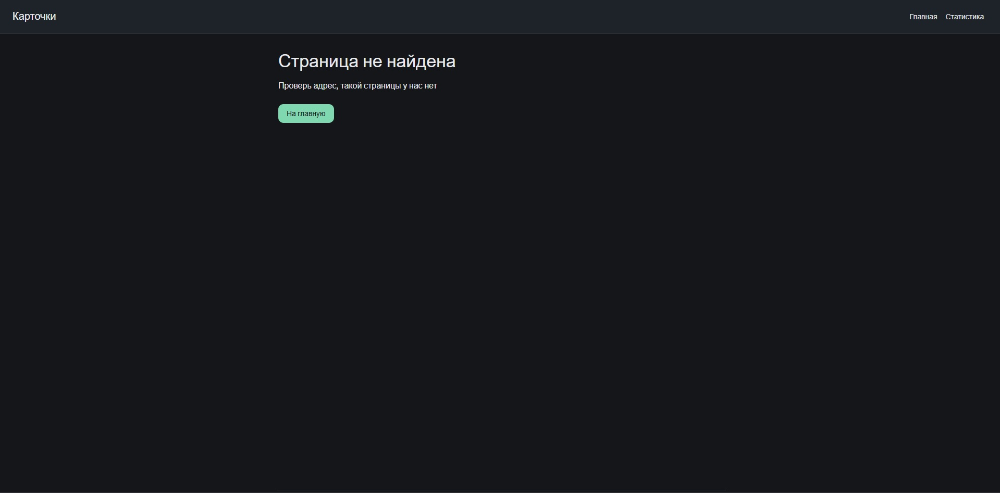

# Карточки

Веб-приложение для запоминания слов и терминов по карточкам. У карточки две стороны: вопрос и ответ. Карточки собираются в колоды, колоду можно проходить в режиме тренировки.

Лабораторная работа №1 — фронтенд на React + TypeScript, данные пока лежат в моках.

## Сценарии

- Посмотреть свои колоды
- Открыть колоду и посмотреть карточки в ней
- Добавить карточку
- Пройти колоду: смотрю вопрос, вспоминаю, показываю ответ, иду дальше
- Отметить карточку выученной
- Посмотреть статистику по колодам

## Экраны

| Адрес | Экран | Что на нём |
| --- | --- | --- |
| `/` | Главная | список колод, у каждой название, описание и число карточек |
| `/decks/:id` | Колода | тренажёр, форма добавления карточки и список карточек |
| `/stats` | Статистика | общий прогресс и прогресс по каждой колоде |
| любой другой | 404 | сообщение и кнопка на главную |

## Стек

React 19 + TypeScript, Vite, React Router, MUI.

## Запуск

```
npm install
npm run dev
```

Откроется на http://localhost:5173

Сборка:

```
npm run build
```

## Структура

```
src/
  components/    Layout, DeckList, CardItem, CardForm, Trainer
  pages/         HomePage, DeckPage, StatsPage, NotFoundPage
  mocks/         decks.ts — колоды с карточками
  types.ts       типы Card и Deck
  theme.ts       тёмная тема MUI
  App.tsx        роуты
  main.tsx       точка входа
```

## Скриншоты





